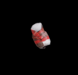
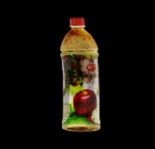
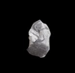
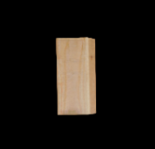

# Scenario Definition File

## File Structure

### 1. Basic Structure

The "Scenario Definition File" of the MetaSejong platform is a core configuration file that defines the mission environment. This file specifies the following elements:
- USD file for the mission space
- Initial camera viewpoint
- Camera installation information for each mission area
- Types and quantities of recyclable waste for mission targets

Competition participants can modify this file to generate training data for AI application development.

The MetaSejong platform reads the `{working directory}/scenario-data/{ENV_METASEJONG_SCENARIO}.yml` file based on the value specified in the environment variable `ENV_METASEJONG_SCENARIO` to configure the mission environment.

Currently, there are 4 provided scenarios:
- demo: Demo scenario
- dongcheon: Dongcheon Hall scenario
- jiphyeon: Jiphyeon Hall scenario
- gwanggaeto: Gwanggaeto Hall scenario

```
{working directory}/scenario-data/
├── demo.yml        # Demo scenario
├── dongcheon.yml   # Dongcheon Hall scenario
├── jiphyeon.yml    # Jiphyeon Hall scenario
└── gwanggaeto.yml  # Gwanggaeto Hall scenario
```

### 2. YAML File Structure
Each scenario YAML file is structured as follows:

```yaml
scenario:     # Basic scenario information. Explained in '2.1 Scenario Overview'
  name: Demo  # Name used as scenario identifier
  description: Demo scenario  # Scenario description
  time_constraint: 15   # Time limit for scenario execution (minutes)
playground:   # Virtual space information. Explained in '2.2 Virtual Space Information'
  usd_file: playground/S1/SejongUniv_S1.usd  # Mission space USD file (do not modify)
  view_point:  # Initial camera viewpoint
    camera_view_eye: [-113.03272, 64.98621, 30.59225]  # Camera position
    camera_view_target: [-63, 119, 1.02]  # Camera target point
mission:    # Mission information. Explained in '2.3 Mission Information'
  {area_name}:  # Mission area identifier
    camera_info:  # CCTV settings
      focal_length: 4  # Focal length (cm)
      horizontal_aperture: 4.8  # Horizontal aperture width (cm). Vertical calculated at 16:9 ratio
      ground_height: 1.0  # Target ground elevation (m)
      position: [x, y, z]  # Camera installation position
      rotation: [rx, ry, rz]  # Camera installation angles
    mission_objects:  # Mission target object information
      {object_name}: count  # Object name and quantity
robot:    # Robot configuration. Explained in '2.4 Robot Information'
  start_point: [x, y, z]  # Initial robot position coordinates
```

#### 2.1. Scenario Overview

Defines the basic information of the scenario, including the name, description, and completion time limit.

- Properties
  
  - name: Unique identifier name for the scenario
  - description: Detailed description of the scenario
  - time_constraint: Time limit for scenario execution (minutes). The competition ends when this time expires.

- Example 
  ```yaml
  scenario:
    name: "Demo"
    description: "Scenario description text"
    time_constraint: 15
  ```

#### 2.2 Virtual Space Information

Defines information about the 3D virtual space used in the scenario. Includes the IsaacSim USD file path and initial viewpoint information.

- Properties

  - usd_file: Path to the IsaacSim 3D model file (USD) for the mission space
  - view_point: Camera viewpoint information at simulation start
    - camera_view_eye: Camera position coordinates
    - camera_view_target: Coordinates of the point the camera is looking at

- Example 

  ```yaml
  scenario:
    playground:
      usd_file: playground/demo_area.usd  # Relative path from {python execution path}/resources/models
      view_point:
        camera_view_eye: [-113.03272, 64.98621, 30.59225]
        camera_view_target: [-63, 119, 1.02]
  ```

#### 2.3. Mission Information

Defines the CCTV information installed in each mission area and the types and quantities of recyclable waste to be placed in that area.

- Properties 

  - {area_name}: Unique identifier for the mission area. Specified in {scenario_id}_{sequence} format

    - camera_info: CCTV configuration information for the mission area
    
      - focal_length: Camera focal length (centimeters)
      - horizontal_aperture: Sensor horizontal width (centimeters). Vertical is automatically calculated at 16:9 ratio
      - ground_height: Ground elevation of the target area (meters)
      - position: Camera installation position coordinates (meters)
      - rotation: Camera installation angles (degrees)

    - mission_objects: Recyclable waste information to be placed in the area
      - {object_type}: Number of objects to place for each waste type

- Recyclable Waste Types

  | Type | Classification | Image |
  |------|----------|-------|
  |cola_can | aluminum |  |
  |master_chef_can | aluminum|  |
  |juice | plastic|  |
  |cracker_box | paper|  |
  |tissue | paper|  |
  |wood_block | none|  |
  |mug | none|  |

- Example 

  ```yaml
  scenario:
    mission:
      demo_1:
        camera_info:
          focal_length: 4
          horizontal_aperture: 4.8
          position: [-60.86416, 152.94693, 21.47511]
          rotation: [-74.492, -23.79, -168.446]
          ground_height: 16.5
        mission_objects:
          master_chef_can: 3  # 3 Master Chef cans
          wood_block: 3       # 3 wood blocks
          tissue: 3           # 3 tissues
          cola_can: 3         # 3 cola cans
          juice: 3            # 3 juice containers
  ```

#### 2.4. Robot Information

Specifies the initial deployment position of the robot using coordinates.

- Example

  ```yaml
  scenario:
    robot:
      start_point: [x, y, z]  # Initial robot position coordinates
  ```
